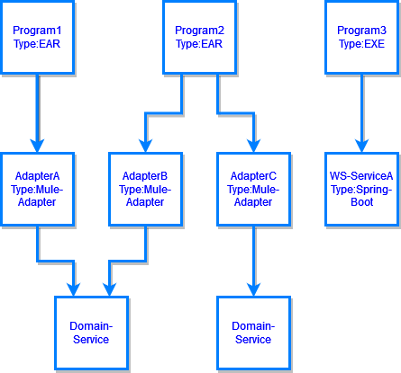
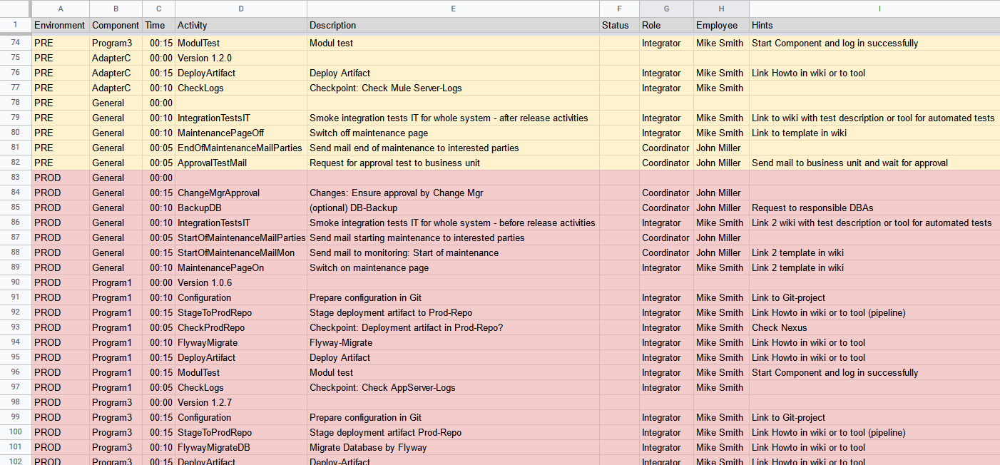
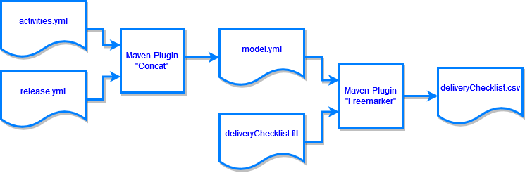
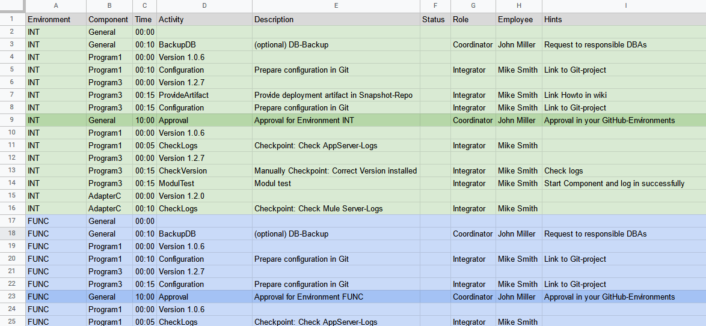
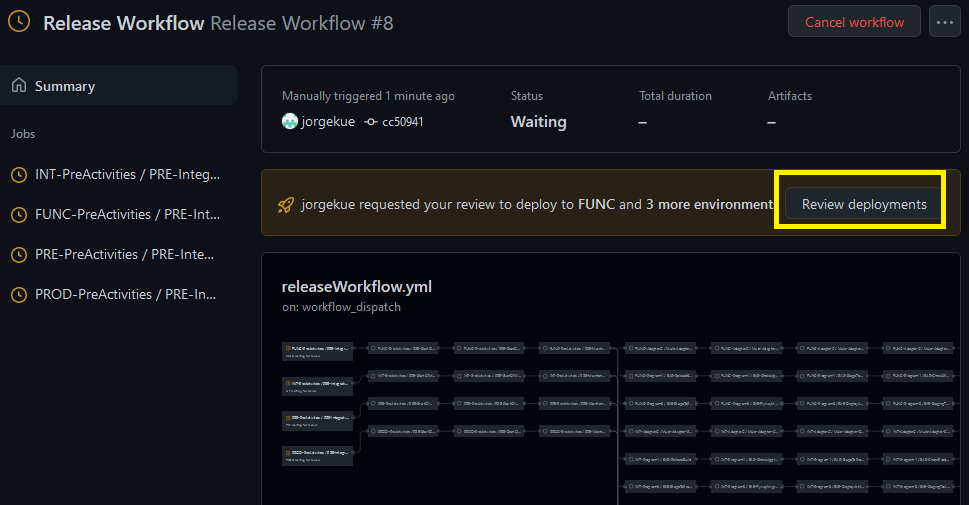

# delivery-master

### Table of Content  
- [Introduction](#introduction)  
- [Preparation](#preparation)  
- [Release Definition](#release-definition)  
- [Generation CSV file](#generation-csv-file)  
- [Generation GitHub Action-files](#generation-github-action-files)  
  - [Reusable Component Workflows](#reusable-component-workflows)  
  - [Release Workflow](#release-workflow)  
- [Links](#links)
# Introduction
The delivery-master helps you master the complete releases of your system consisting of different components to be deployed across different staging environments.
Typically we use environments like Integration (INT), Functional (FUNC), Preproduction (PRE) and Production (PROD).
Whereas in case of a hot fix we want to use only a dedicated Hotfix environment as the way to Production. 
Dependent on the features the deployment aspects could be different to each component: 
Do we have to migrate the database, to change the configuration or to make the deployment of new code? Imagine a system like the following:



There are two main use cases considered within the delivery master:
1. Generates a complete and consistent check list with necessary (manual) activities as CSV file you can then convert into typically spreadsheet file like an Excel file and make some beautifying with it for your convenience as you can see below. You find a generated example CSV file with name deliveryChecklist.csv in the main folder of this project. 



2. Generates a combination of GitHub Actions files for automation purposes in combination with some few remaining manual activities. The following Release Workflow-run gives you a first impression.


[Back to Table of Content ](#table-of-content)
# Preparation  

First define basically the necessary activities of the component types of your system or infrastructure in the model file activities.yml.
Component type could be an Application Server Enterprise Archive (EAR), a Windows Program (EXE), a Spring Boot Service, a Spring Batch, an Integration Platform Adapter, a workflow artifact, etc.
Define also necessary preparing or concluding activities of the stages.
Besides the self-explanatory attributes we define basically to which environment (attribute 'envs') and optionally to which deployment aspects (attribute 'tags') the activity applies.
Finally, we can apply a role to the activity (optionally).
See example file /src/main/resources/activities.yml. The following excerpt gives you a first impression. 
```javascript
# model definitions of component based activities
componentTypes:
  -
    componentType: EAR
    activities:
      -
        name: "Configuration"
        description: "Prepare configuration in Git"
        hints: '"Link to Git-project"'
        tags: [CONFIG]
        envs: [INT, FUNC, PRE, HOT, PROD]
        time: '00:10'
        role: Integrator
        execution: "manualBefore"
...
      -
        name: "FlywayMigrate"
        description: "Flyway-Migrate"
        hints: '"Link Howto in wiki or to tool"'
        tags: [DB]
        envs: [INT, FUNC, PRE, HOT, PROD]
        time: '00:10'
        role: Integrator
        execution: "auto"
      -
        name: "DeployArtifact"
        description: "Deploy Artifact"
        hints: '"Link Howto in wiki or to tool"'
        tags: [DEPLOY, CONFIG]
        envs: [INT, FUNC, PRE, HOT, PROD]
        time: '00:15'
        role: Integrator
        execution: "auto"
...
```
[Back to Table of Content ](#table-of-content)
# Release Definition
For each release we define then the concrete environments we will go through for our release, the concrete roles and the concrete components based on the defined component types previously.
We constrain the components to the deployment aspects in the attribute 'tags'.
See example file /src/main/resources/release.yml.
Below you find a first impression:
```javascript
# define necessary environments for release
# possible environment are [INT, FUNC, PRE, HOT, PROD]

environments: [INT, FUNC, PRE, PROD]

# define the roles for release
activityRoles:
  -
    rolename: Coordinator
    employee: John Miller
  -
    rolename: Integrator
    employee: Mike Smith

reviewRole:
  rolename: Coordinator
  employee: John Miller
    
# define necessary components and their aspects for release
# possible tags: [DEPLOY, DB, CONFIG], if tags is not set thea all activities are considered by default
components:
  -
    name: Program1
    componentType: EAR
    version: 1.0.6
    tags: [DEPLOY, DB, CONFIG]
  -
    name: Program2
    componentType: EXE
    version: 1.2.7
    tags: [DEPLOY, DB, CONFIG]
...
```
[Back to Table of Content ](#table-of-content)
# Generation CSV file 
Generate the delivery check list as CSV file based on your model files with following maven command:  
`mvn clean generate-sources`  

The generation process is illustrated basically in the following image:



For technical reason we concatenate first the two model files, use then a freemarker template to generate the CSV file with our required activities for the release.  

[Back to Table of Content ](#table-of-content)
# Generation GitHub Action-files
## Reusable Component Workflows
For the other main use case first we generate the Reusable Component Workflows based on each component type in our model file with following maven command:  
`mvn clean generate-sources –DcomponentWorkflows`

For each type we get a Reusable Workflow file like below:
```javascript
name: EAR Activities Workflow
on:
  workflow_call:
    inputs:
      env:
        required: true
        type: string
      name:
        required: true
        type: string
      version:
        required: true
        type: string
      tags:
        required: false
        type: string
jobs:
  EAR-ReleaseBuild:
    if: ${{ ( contains(inputs.tags, 'DEPLOY') ) && ( contains(inputs.env, 'INT') || contains(inputs.env, 'HOT') ) }}
    runs-on: ubuntu-latest
    environment: ${{ inputs.env }}
    steps:
      - name: ReleaseBuild
        run: echo "ReleaseBuild with params (env=${{ inputs.env }}, name=${{ inputs.name }}, version=${{ inputs.version }})."
  EAR-CheckApprovalRepo:
    if: ${{ always() && !(contains(needs.*.result, 'failure')) && ( contains(inputs.tags, 'DEPLOY') ) && ( contains(inputs.env, 'INT') || contains(inputs.env, 'HOT') ) }}
    needs: EAR-ReleaseBuild
    runs-on: ubuntu-latest
    steps:
      - name: CheckApprovalRepo
        run: echo "CheckApprovalRepo with params (env=${{ inputs.env }}, name=${{ inputs.name }}, version=${{ inputs.version }})."
...
```
The generated code is a boilerplate code only.  
For the beginning there is given a shell used within the steps printing the passed parameters.
Dependent on the concrete DevOps-Infrastructure we still have to implement concrete GitHub Actions in each job later.
We will call these Reusable Component Workflows with the different required parameters from a higher level so-called Release Workflow as we will see below.
The conditions for each job are coming from the modelled attributes 'envs' and 'tags' of our activities.
The execution of the jobs are ordered sequential by default, see needs-clause in job definition.
The preparing and concluding activities will also get their own Reusable Workflow files. 

[Back to Table of Content ](#table-of-content)
## Release Workflow
We will generate the higher levelled Release Workflow with the following command:  
`mvn clean generate-sources –DrelWorkflow`

The resulting file `releaseWorkflow.yml` looks like the following excerpt:
```javascript
name: Release Workflow
on:
  workflow_dispatch

jobs:
  INT-PreActivities:
    uses: ./.github/workflows/activitiesPre.yml
    with:
      env: INT
  INT-Program1:
    uses: ./.github/workflows/componentEAR.yml
    needs: INT-PreActivities
    with:
      env: INT
      name: Program1
      version: 1.0.6
      tags: 'DEPLOY,DB,CONFIG'
  INT-Program3:
    uses: ./.github/workflows/componentEXE.yml
    needs: INT-PreActivities
    with:
      env: INT
      name: Program3
      version: 1.2.7
      tags: 'DEPLOY,DB,CONFIG'
  INT-AdapterC:
    uses: ./.github/workflows/componentMule-Adapter.yml
    needs: INT-PreActivities
    with:
      env: INT
      name: AdapterC
      version: 1.2.0
      tags: 'DEPLOY'
  INT-PostActivities:
    uses: ./.github/workflows/activitiesPost.yml
    with:
      env: INT
    needs: [INT-Program1,INT-Program3,INT-AdapterC]
...
```
For each environment like INT as shown above the release workflow will begin with the preparing activities (PreActivities). 
If succeeded then all component based reusable workflows will start parallel.
If all components based workflows are finished with success the concluding activities (PostActivities) are processed.

In addition with the Release Workflow we will get an additional CSV file with the possibly few remaining interactive activities, see below. You find a generated example CSV file with name manualReleaseActivities.csv in the main folder of this project.    



One of the main features of GitHub Actions we are using in this approach are the environments. 
We define Reviewers in the Protections Rules of each environment and thus get more control over the overall Release Workflow as well as the opportunity to make our remaining manual activities after the current and the next environment.
This concept, the conjunction of manual and automated activities is shown in the figure below:  


If the Release Workflow is started we are requested for reviews in each environment:



After reviews are all done and jobs succeeded, we will get the result as shown above in the introduction.  

[Back to Table of Content ](#table-of-content)
# Links
Delivery Master (this project): https://github.com/jorgekue/delivery-master  
Freemarker: https://freemarker.apache.org/  
GitHub Actions: https://docs.github.com/en/actions  
Referenced Integration Platform: https://www.mulesoft.com/  
Flyway-Migration: https://flywaydb.org/  
Freemarker-Extension: https://github.com/jorgekue/fm-extensions  
Maven-Plugin yaml-codegen-maven: https://github.com/VboxNick/yaml-codegen-maven  
Maven-Plugin concatenate-maven-plugin: https://github.com/mike10004/concatenate-maven-plugin  


